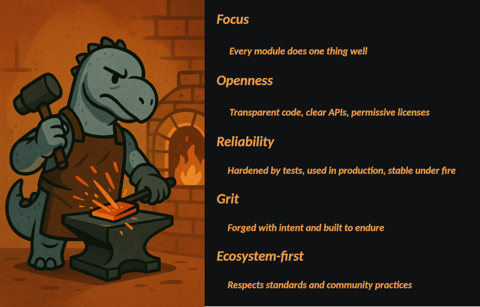

# 🔥 The Deno Forge Manifest

Welcome to `@deno-forge`, a collection of modular tools forged for serious Deno development. This registry is curated with purpose and precision—every module a tool, every tool part of a greater whole.

Our guiding philosophy is **craftsmanship**. These modules are not merely written—they are forged, tested, quenched, and wielded.

---



---

## 🧱 Modules of the Forge

### `@deno-forge/scaffold`

> scaffold JSR modules

---

## 🛠 Example Usage

```ts
import { makeReadme } from "jsr:@deno-forge/scaffold"
```

---

## 🧠 Contributing

Modules in this forge adhere to strict test coverage and design expectations. New ideas should be proposed in the form of a tool concept and matching name in the forge metaphor.

Submit pull requests to the relevant repositories. Keep the flame alive.

---

## 🛡 License & Trademark

All brand materials in this repository—logos, illustrations, mascots, and style guidelines—are licensed under the Creative Commons Attribution 4.0 International (CC BY 4.0) license.

> You are free to use, remix, and share these assets—even in commercial projects—as long as you credit Deno Forge.

⚠️ "Deno Forge" and "The Deno Smiths" are trademarks of the Deno Forge project.
Use of the names or associated characters does not imply endorsement.

## 🔚 Final Word

The forge is never cold. It waits for your hammer.

— `@deno-forge`
