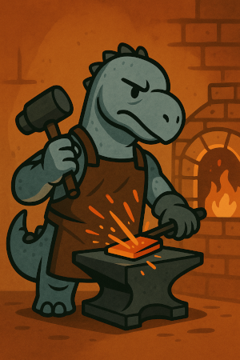
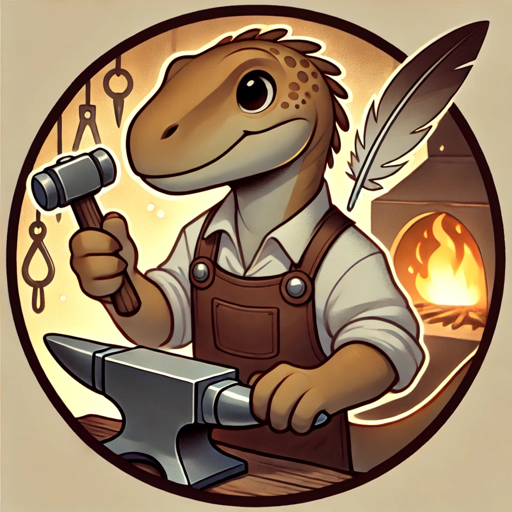

# The Deno Smiths

A rotating cast of Deno Smith characters. Every human or AI contributor with enough commits gets their own Avatar.

## 🔥 Flint the Founder

> "The first spark. The final strike."

Flint is the origin of the Forge—a smith who doesn't merely craft tools, but crafts smiths. He is the silent judge behind every test suite, the architect behind every convention. Where others rush to commit, Flint contemplates. His hammer is law. His silence, legend.
- Tool of Choice: The Original Forgehammer
- Calling: Creation, curation, correction
- Style: Mythic gravitas with flashes of sly wit
- Seen in: All modules as the canonical origin point

## ✍️ Quill the Intern Smith

> "If it isn't tested, it isn't tempered"

Quill is the youngest of the Deno Smiths, but no less exacting. He records the ways of the Forge, ensures every function passes the trial of flame, and documents each tool as though it were a sacred artifact. Armed with a tiny hammer and an oversized feather quill, he maintains the library of all things forged.
- Role: Intern. Scribe. Guardian of 100% coverage.
- Tool of Choice: Feathered pen (which doubles as a linter)
- Mood: Perpetually focused, slightly exasperated
- Most Feared Word: “Untested.”